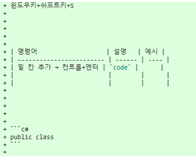

# Git 기초

## 개념

### SCM이란?

Source Code Manager 의 약자로, 코드의 버전을 관리하기위해 존재한다.

### Git

Git은 Linus Torvalds가 만든 SCM으로, 현재 가장많이 사용된다.

### Github

github은, git이 관리하는 Repo의 원격 저장소를 제공하는 서비스다. 가장많이 사용하며, 오픈소스 프로젝트들이 성장하는 곳이다. 최근 MS에 인수되었다.

컨트롤+1,2,3..으로 목차 큰글씨 만듦.


## Sourcetree

윈도우키+쉬프트키+S




| 명령어                   | 설명   | 예시 |
| ------------------------ | ------ | ---- |
| 밑 칸 추가 → 컨트롤+엔터 | `code` |      |
|                          |        |      |
|                          |        |      |


```c#
public class
```


### clone

git remote repo는 다운로드가 아니라 clone을 해야한다.

